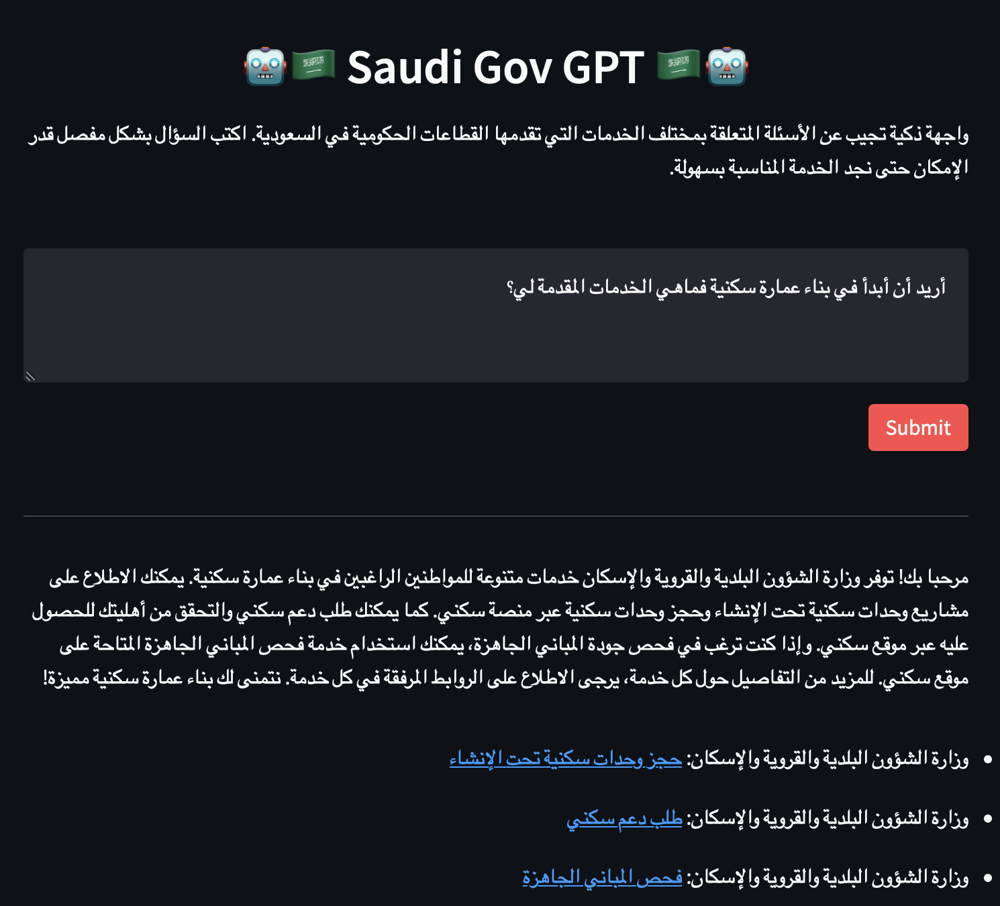

# Saudi Gov GPT

The Saudi Gov GPT is a friendly agent that aims to answer any questions regarding the electronic services provided by the Saudi government agencies. The system covers over 1500 services, providing coverage of approximately 90% of all services. The aim of the system is to improve accessibility and efficiency for users who are seeking information about government services.



# Motivation & Benefits

The motivation behind creating this system was to help users navigate the often complex and confusing landscape of government services. The Saudi Gov GPT aims to provide a user-friendly interface that can quickly and accurately answer questions about government services.

# Technical Details

The Saudi Gov GPT system consists of two main components: information retrieval and the GPT experience. In the first part, the different services are embedded with OpenAI's embeddings and saved to `data/embeddings.npz`. During inference, we embed user query first, and then we use the `FAISS` library to quickly retrieve the closest entries to the query (embeddings). We also do normalization to unify the latent embedding space.

After we have obtained the top N entries, we retrieve their raw data and include them in the prompt that we send to the OpenAI API endpoint. The prompt can be found in the app.py file.

# How to Use

To use the Saudi Gov GPT, first install the requirements and then simply run the app.py file with streamlit and enter your question in the prompt. The system will then provide you with an answer based on the closest match to your query.

```bash
git clone [REPO]
cd [REPO]
pip install -r requirements.txt
```
And then run the app

```bash
streamlit run app.py
```

# Examples

Some example questions that the system can answer include:

<div style='direction:rtl'>

أريد أن أبدأ في بناء عمارة سكنية فماهي الخدمات المقدمة لي؟

كيف أقوم بتجديد رخصة القيادة ؟

لدي مؤسسة تجارية جديدة ولا أملك أدنى فكرة من أين أبدأ فهل هناك أي خدمات ذات علاقة؟

لدي فكرة جديدة وأحب أن أحولها إلى واقع فهل هناك خدمات ذات علاقة ؟

أريد بناء مصنع جديد فماذا أفعل ؟

ماهي أبرز خدمات وزارة التعليم للمعلمين ؟

ماهي الخدمات التي تهمني كأب ولدي العديد من الأطفال؟

ماهي مراكز ضيافة الأطفال؟

ماهي الخدمات المقدمة للمسنين وكبار السن؟

لدي عدد من المواشي  والمزارع فماهي الخدمات المتوفرة لي ؟
</div>

# Future Directions

There are at least three directions in which this project can be taken to further improve it:

- More comprehensive scraping for each service along with their metadata (100% coverage)
- Experiment with fine-tuned local models instead of calling the OpenAI endpoint (Alpaca is showing promising results).
- Experiment with different embedding and tokenizers for Arabic text instead of relying on OpenAI endpoints.

# Demo

A live demo of the system is available [here](https://fahd09-saudigovgpt-app-r7uqmc.streamlit.app). Please note that this is a demo to showcase the incredible technology of GPT models and should not be used for anything serious.